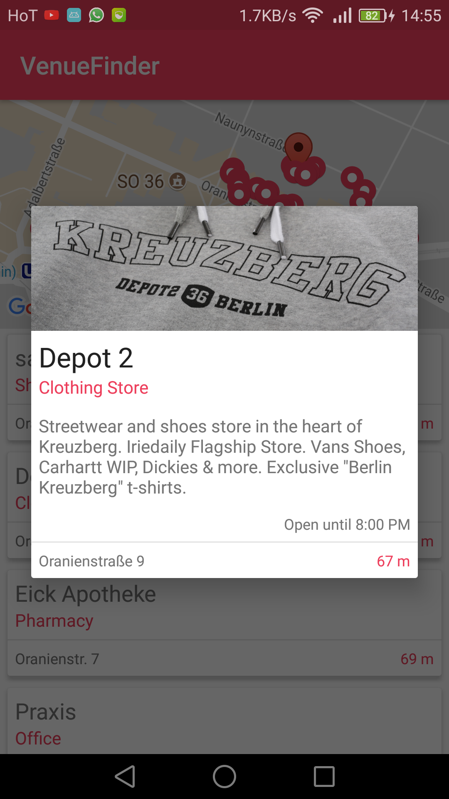

# VenueFinder

> This application was made with :heart: and a few cups of :coffee:

#### General
Welcome to the VenueFinder! It allows browsing through the Venues nearby a certain location. In short the application features the following Views and interaction possibilities:
- The found Venues are displayed on a CardView with additional information.
- The map is realized with the Google Maps API and displays the Venues in their location.
- Clicking on an item in the CardView fetches the complete Venue and shows the information on a Dialog.
- Clicking on the marker in the map shows the name and category of the Venue.
- Clicking on the information-window of the marker fetches the complete Venue and opens the Dialog with the Details.

#### Features
- **List with Venues:** Provides the user with a short overview of the Venues that are nearby. They are sorted in ascending order, dependent on the distance to the starting point.
- **Map with the Venues:** The user is given a map with the fetched Venues displayed through marker. I have included this feature, since it's important to provide the user with some sort of orientation and direction. The default marker is on the position of the location, that's used for the fetch-request.
- **Display of a detailed Venue:** The list with the compact Venues does not give enough information but does provide the user with a fast and short overview. More information are displayed on the Details. They are not in a seperate Activity, so the user can quickly navigate back.

#### Most common Errors
- The user might have slow internet. Until the data has been successfully fetched, a progress bar indicates the user that there is a progress happening in the background. If the internet is too slow, a timeout stops the request and a Toast-message informs the user of the situation.
- The user might have no internet at all. In this situation a Toast-message appears once internet is needed for a request.
- The user might click on another Venue, while one is already being loaded. In this situation all requests are processed and multiple dialog windows are opened.

#### Open-Source Libraries
- **Retrofit:** Is the framework that is used in order to fetch data from the API. It's Callbacks either display the Venue(s) after a successful response or show an Error. It was my first time using this library. It made creating the Request, providing Callbacks and parsing the Response (with help of Gson) cleaner and easier.

- **Gson:** This library is used in order to parse the fetched data into their respective objects in two cases:
  - parse the fetched data in combination with Retrofit
  - send data to the `DetailsFragment`, where it is (de)serialized as Json

  Gson works well in combination with Retrofit and Json (or their String representative) can be used as an additional Bundle-argument to the `DetailsFragment`.
- **Butterknife:** Binding the Views to their variables.

- **Picasso:** Is used to fetch images using the URL. Loading images from an URL and displaying them can be hazardous and Picasso takes a lot of the work.

#### Scale of Images
Picasso is responsible for fetching and caching images. In the application itself it is only used in order to display the images in the Details-View. The images are scaled down with `.resize(image.getWidth(), image.getHeight())`, this does not respect the aspect ratio of the image. Which is why additionally `.centerCrop()` is used, it scales the image and crops out the leftover parts.
